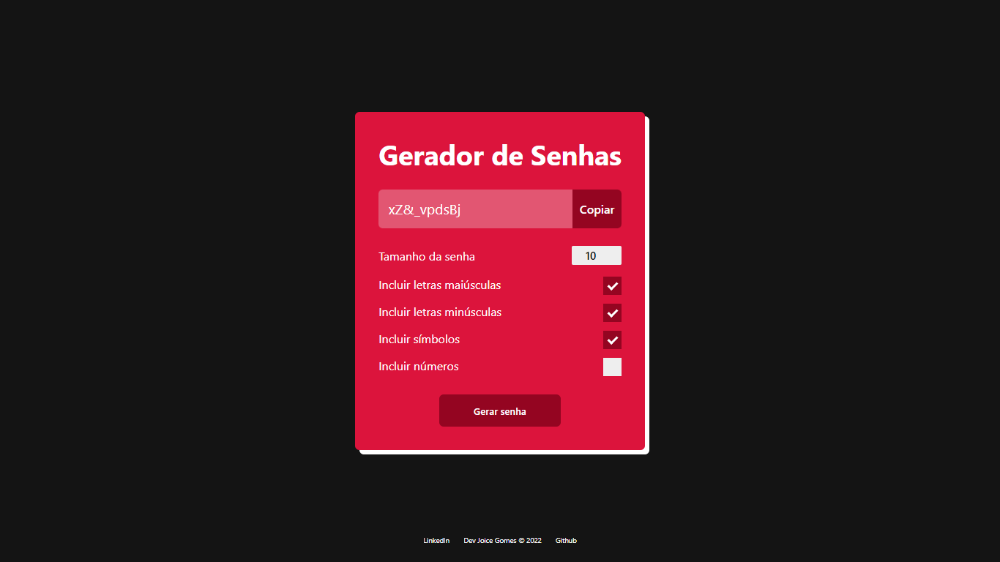

# Gerador de senha

Gerador de senha desenvolvido com HTML, CSS e JavaScript.   

Com o gerador você pode gerar uma senha aleatória escolhendo o tamanho da senha e a opção de incluir letras maiúsculas e minúsculas, símbolos e números, assim você vai poder utilizar uma senha forte em suas contas pessoais.

Acesse o site e gere sua senha clicando [aqui!](https://joi-gn.github.io/gerador-senha-js/)

